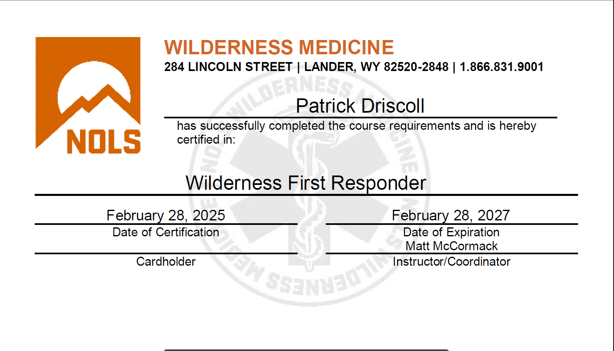
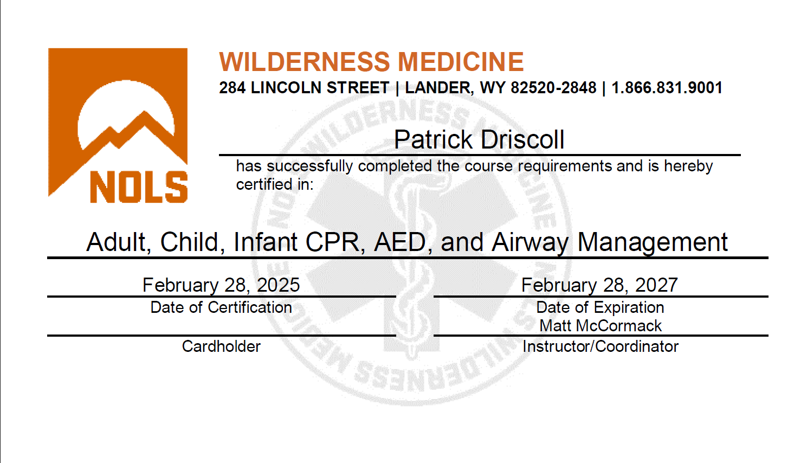
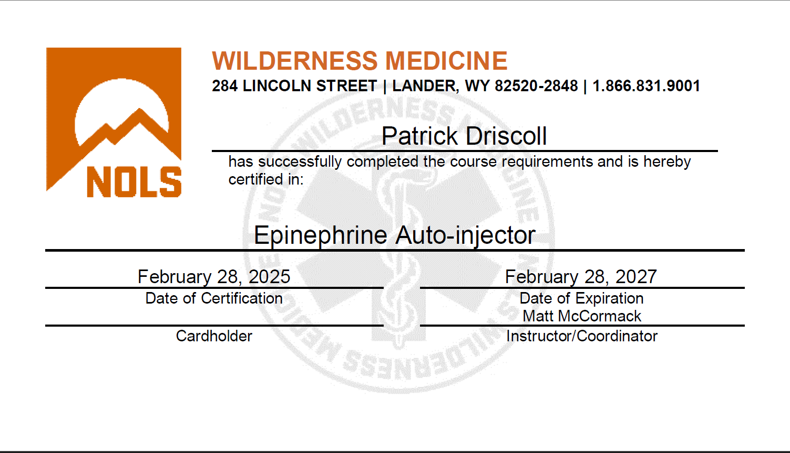
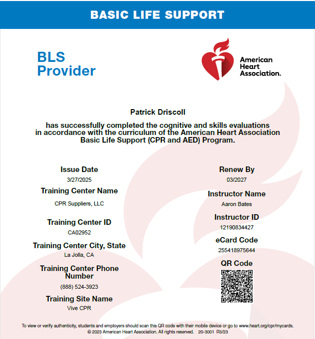

# About Me

## Education:

### Creighton University (August 2016 - May 2020)
I double majored in two environmental science tracks, Golbal Environmental Systems and Environmental Policy, and minored in Sustainability. While at Creighton, I participated in the study abroad program where I traveled to Sydney, Australia for one semester from July - December of 2018. I graduated from Creighton University in May, 2020.

### University of Oklahoma (August 2022 - May 2024)

# Certifications
National Outdoor Leadership School - Wilderness First Responder (NOLS - WFR) 
National Outdoor Leadership School - Adult, Child, Infant CPR, AED, and Airway Management 
National Outdoor Leadership School - Epinephrine Auto-injector 
American Heart Association - Basic Life Support (AHA - BLS) 
