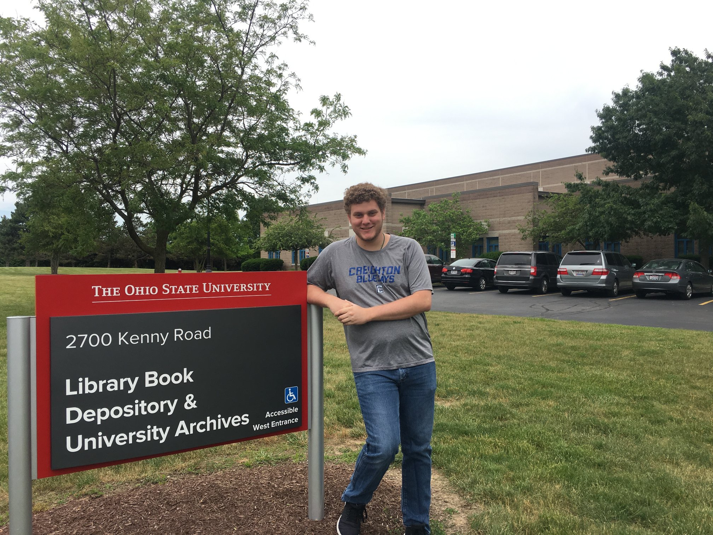

## Biological Invasions: A Zebra Mussel Case Study

**Project description:** In May of 2019, Dr. Adam Sundberg (my advisor from Creighton University) and I started conducting research on the Zebra Mussel (Dreissena polymorpha). Below is a description of our project and the findings that we discovered.

### 1. Research

In order to gather information concerning senate hearings, laws (drafts and published laws), meeting information, correspondance, newspapers, and studies, we flew to Columbus, Ohio to visit Ohio State University. We visited the Library Book Depository and University Archives to view and access data from former senator John Glenn. In total, we went through 17 boxes of data (which totaled 4,968 pages), and took photos of the box, each folder's title and contents relevant to our search, imported the photos to a computer and made the pages searchable, and developed a rough network and chronology of events. Data collection took roughly two days and reading the documents and making the network and chronolgy took about 5 months.

### 2. Presentation

<iframe src="https://bluecast.hosted.panopto.com/Panopto/Pages/Embed.aspx?id=33573f6a-0b20-4073-8391-aba60039ae3a&autoplay=false&offerviewer=true&showtitle=true&showbrand=true&captions=true&interactivity=all" height="405" width="720" style="border: 1px solid #464646;" allowfullscreen allow="autoplay" aria-label="Panopto Embedded Video Player"></iframe>

<iframe src="https://bluecast.hosted.panopto.com/Panopto/Pages/Embed.aspx?id=2575fecc-33f9-4c7f-8611-ab98001052bd&autoplay=false&offerviewer=true&showtitle=true&showbrand=true&captions=true&interactivity=all" height="405" width="720" style="border: 1px solid #464646;" allowfullscreen allow="autoplay" aria-label="Panopto Embedded Video Player"></iframe>

For my senior capstone class, Senior Seminar, I recorded a video where I discuss the concepts of invasive species, my research, the impacts of Zebra Mussels, the transmission of these species through ballast water, policies of the Great Lakes, environmnetal policies concering the Great Lakes and their outcomes. I also recorded a video where I answered questions from my classmates and professors. Normally, this presentation would have been given in-person but was given at my house as campus was closed as a result of COVID-19.
