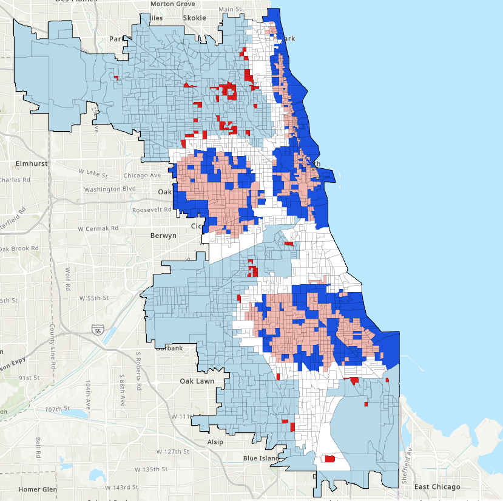
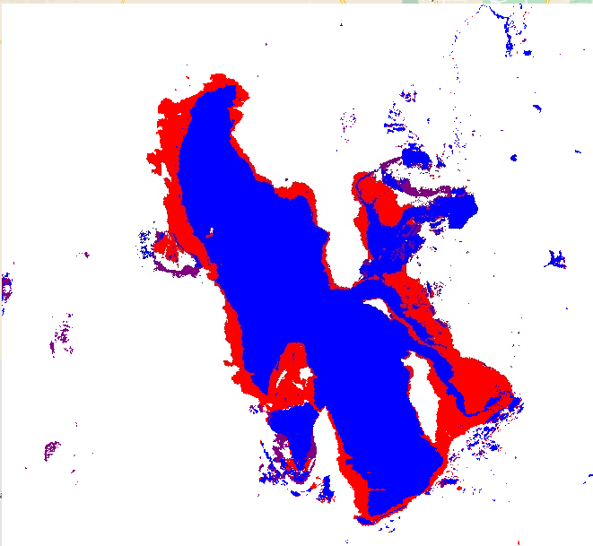

## Portfolio

---

### Maps, Code, and other Assignments

Texas Mesonet IDW and Kriging Maps

---

---

---
[Project 4 Title](http://example.com/)

---
### Links to Larger Projects

- [The Burning Question: California and the Camp Wildfire of 2018](https://storymaps.arcgis.com/stories/cffb4ae19cf24701a07849973f2bd0ea)
- [Biological Invasions: A Zebra Mussel Case Study](Zebra_Mussels)
- [Project 3 Title](http://example.com/)
- [Project 4 Title](http://example.com/)
- [Project 5 Title](http://example.com/)

---

---

Page template forked from <a href="https://github.com/evanca/quick-portfolio">evanca</a>

<!-- Remove above link if you don't want to attibute -->
